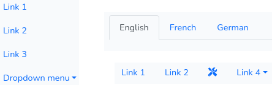

# Menu and Tab Utils

[By Sébastien L'haire](http://sebastien.lhaire.org)

A Laravel library to to build menus and tabs navigation utilities, based on [Boostrap](https://getbootstrap.com/) 5 CSS Framework. Package demo available [here](https://sebastien.lhaire.org/menuutils).



# Installation

1. install package

`composer require seblhaire/menuandtabutils`

2.  Composer will automatically link the package with Laravel. But you still can explicitly add provider and facade to your `config/app.php`:
```php
'providers' => [
	Seblhaire\MenuAndTabUtils\MenuServiceProvider::class,
]
```

# Javascript and stylesheets

On a webpage, every JS library and CSS stylesheets can be linked separately. If you choose this classical way, first download and install Bootstrap. Then publish package files as explained above and put following tags in your template:

Websites often use many libraries and stylesheets, and browsers must download many files before the site can be rendered properly. Modern websites come with a single compressed JavaScript file which concatenates necessary scripts; same principle for stylesheets. With Laravel you can use [Laravel Mix](https://github.com/JeffreyWay/laravel-mix) to compile files.

Use [NPM](https://www.npmjs.com/) package manager :
`npm install bootstrap`

Then your js source file should be something like this:

```js
require('bootstrap');
```
For your stylesheet:

```css
@import '~bootstrap/scss/bootstrap';
```

# Config files

Accessible through

```php
config('menuutils')
config('tabutils')
```

These default values are used by tools in next sections. In case you need to change default values, use command `php artisan vendor:publish` and chose the appropriate package in the list. Then config files will be available in file `config/vendor/seblhaire/`.

# MenuUtils

```php
MenuUtils::init(string $id, array $data)
```
This simple helper assigns a `<ul class="nav">` menu to a variable.
## Parameters:
* `id`: id of main nav
* `data`: array parameter. Content:
  * `menu`: **mandatory** array of value to build menu items. Cf below.
	* `current`: id of menu element that is active, i.e. highlighted. Should not be an dropdown menu item.
	* `ulclass`: class of nav main `<ul>` element. For a vertical menu: `nav flex-column`. Default: `nav`.
	* `ulattr`: array of attributes that must be added to nav main `<ul>`. Default: empty array.
	* `liclass`: class of menu elements `<li>`. Default: `nav-item`,
	* `liattr`: array of attributes that must be added to menu `<li>` elements. Default: empty array.
	* `aclass`: class of menu element link `<a>`: Default: `nav-link`.
	* `lidropdwn`: class of menu element `<li>` that contains dropdown menu. Default:  `nav-item dropdown`.
	* `adroptoggle`: class of menu element link `<a>` that opens a dropdown menu, Default: `nav-link dropdown-toggle`.
	* `dropdwnmenuclass`: class of `<ul>` that contains dropdown menu items. Default: `dropdown-menu`.
	* `dropitem`: class of dropdown menu's elements `<li>`. Default: `dropdown-item`.
	* `dropdivider`: class of dropdown menu divider (`<hr>` element). Default:  `dropdown-divider`.
	* `active`: class of current item. Default: `"active"`

## Define menu elements

Here are the details to build your navigation menu in `menu` parameter.

```
$element = MenuUtils::init('simple-nav',
[
  'current' => 'link1',
  'menu' => [ // defines the menu content
    'link1' => [
      'title' => 'Link 1',
      'target' => route('menuutils'),
    ],
    ...
		'link3' => [
			'icon' => '<i class="fa-solid fa-screwdriver-wrench"></i>',
			'title' => 'Tools',
			'target' => route('menuutils'),
		],
    'link4' => [
      'title' => 'Link 4',
      'dropdown' => [ // dropdown menu replaces default target
        'link4-1' => [ // drowpdown items are defined same way as level one items
          'title' =>'Link 4.1',
          'target' => route('menuutils'),
        ],
        ...
        'sep' => null, // a separator is drawn if array value is null
      ]
    ],
  ]
]);
```

Array keys are used for menu element id. Values are in a sub-array.

* `icon`: image or icon to be displayed in menu item. Html code. Default: unset or empty.
* `title`:  **mandatory** element text. If icon is set, title is displayed on mouse hover.
* `target`: link target, eg. route. Not used if `dropdown` is set. Default empty.
* `attributes`: array of key-value pairs for additional parameters for `<a>`.
* `liattr`: array of key-value pairs for additional parameters for `<li>`.
* `dropdown`: array of values. In this array, if the value for a key is null, a menu divider is drawn. Parameters are the same as the top level menu items, except `dropdown`.

## Usage

In your controller, pass the result to a variable:

`$menu = MenuUtils::init('myid', [...]);`

If `current` parameter is not defined in parameters, you can use this method:

`$menu->setCurrent('myid')`

Note that item should not be a dropdown menu element. Then pass this variable to a view:

```
return view('mybladetemplate', [
		'menu' => $menu
]);
```

And in your Blade template, insert your variable at the appropriate line:

`{!! $menu !!}`

A page can have several menus. In this case, assign each menu to a different variable.

# BreadcrumbUtils

```php
BreadcrumbUtils::init(string $id, array $data)
```
This simple helper assigns a `<nav aria-label="breadcrumb">` menu to a variable.
## Parameters:
* `id`: id of main nav
* `data`: array parameter. Content:
  * `menu`: **mandatory** array of value to build menu items. Cf below.
	* `navclass`: class of nav element `<nav>`. Default: ''.
	* `navattr`:  array of key-attributes values for `<nav>`. Default:  `['aria-label' => "breadcrumb"]`.
	* `olclass`:  class of list `<ol>`. Default: `breadcrumb`.
	* `olattr`: array of key-value pairs for element `<ol>`. Default: empty array.
	* `liclass`: class of list element `<li>`. Default: `breadcrumb-item`.
	* `liattr`: array of key-value pairs for element `<li>`. Default: empty array.
	* `active`: class of current item. Default: `"active"`.

## Define menu elements

Here are the details to build your navigation menu in `menu` parameter.

```
$element = BreadcrumbUtils::init('breadcrumb-nav', //main nav id
[
  'menu' => [
    'link-9' => [
      'icon' => '&lt;i class="fas fa-home fa-lg"&gt;&lt;/i&gt;',
      'title' => 'Home',
      'target' => route('menuutils', ['type' => 'breadcrumbnav'])
    ],
    'link-10' => [
      'title' => 'Second breadcrumb',
      'target' => route('menuutils', ['type' => 'breadcrumbnav'])
    ],
    'link-11' => [
      'title' => 'Third breadcrumb'
    ],
  ]
]);
```
Array keys are used for menu element id. Values are in a sub-array.

* `icon`: image or icon to be displayed in menu item. Html code. Default: unset or empty.
* `title`:  **mandatory** element text. If icon is set, title is displayed on mouse hover.
* `target`: link target, eg. route. Not used if `dropdown` is set. Default empty.
* `attributes`: array of key-value pairs for additional parameters for `<a>`.

## Usage

In your controller, pass the result to a variable:

`$breadcrumb = BreadcrumbUtils::init('myid', [...]);`

Current element is always the last one. <Then pass this variable to a view:

```
return view('mybladetemplate', [
		'breadcrumb' => $breadcrumb
]);
```

And in your Blade template, insert your variable at the appropriate line:

`{!! $breadcrumb !!}`

A page can have several breadcrumbs. In this case, assign each menu to a different variable.

# TabUtils

```php
TabUtils::init(string $id, array $data)
```

This helper builds the code for tabs and tab contents.

## Parameters:
* `id`: id of tab nav
* `data`: array parameter. Content:
	* `tabs`: **mandatory** array of value to build tab items. Cf below.
	* `current`: id of menu element that is active, i.e. highlighted and open.
	* `ulclass`: class of nav tabs. Default: `nav nav-tabs`.
	* `ulattr`: array of attributes that must be added to nav main `<ul>`. Default: empty array.
	* `liclass`: class of nav element `<li>`. Default: `nav-item`.
	* `liattr`: array of attributes that must be added to nav main `<li>`. Default: empty array.
	* `btnclass`: class of element `<button>`. Default: `nav-link`.
	* `tabcontentclass`: class of tab content main `<div>`. Default: `tab-content`.
	* `maindivattr`: array of attributes that must be added to tab content main `<div>`. Default: empty array.
	* `tabdivclass`: class of tab element content `<div>`. Default: `tab-pane fade`.
	* `tabcontentattr`:  array of attributes that must be added to ab element content `<div>`. Default: empty array.
	* `activetab`: class of current tab element content. Default:  `show active`.
	* `active`: class of current item. Default: `"active"`

## Define tab elements

Here are the details to build your tabs in `tabs` parameter.

```
$element = TabUtils::init('tabs-1', // main tab id
[
	'current' => 'tab1',
	'tabs' => [
		'tab1' => [
			'title' => 'Tabs 1',
			'content' => 'html code...'
		],
		...
	]
]);
```

Array keys are used for menu element id. Values are in a sub-array.

* `icon`: image or icon to be displayed in menu item. Html code. Default: unset or empty.
* `title`:  **mandatory** element text. If icon is set, title is displayed on mouse hover.
* `content`: tab content in HTML.
* `view` : if content is not set, path of blade template that must be displayed in tab, e.g. `tabs.editors`.
* `viewparams`: array of key-values to be passed to blade template set in `view` parameter.

## Usage

In your controller, pass result to a variable:

`$tabs = TabUtils::init('myid', [...]);`

If `current` parameter is not defined in parameters, you can use this method:

`$tabs->setCurrent('myid')`

Then pass this variable to a view:

```
return view('mybladetemplate', [
		'tabs' => $tabs
]);
```

And in your Blade template, insert your variable at the appropriate line:

`{!! $tabs !!}`

A page can have several tabs sets. In this case, assign each tab set to a different variable.
